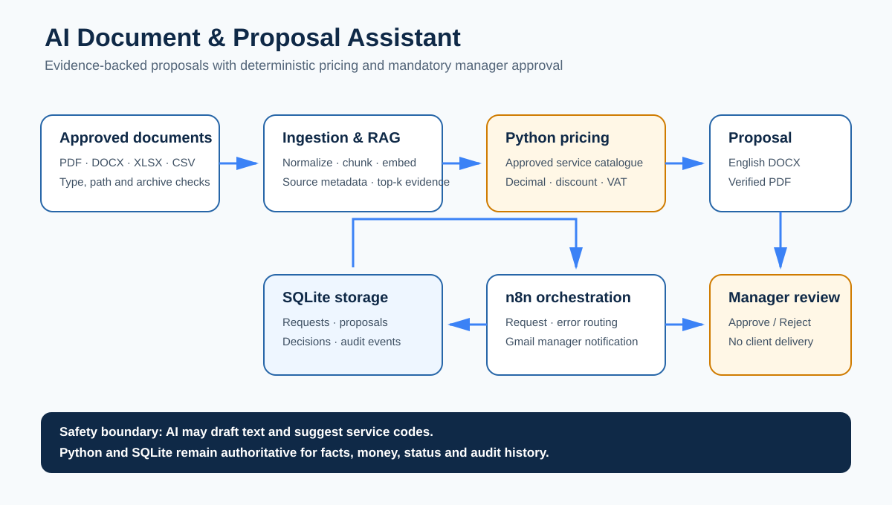
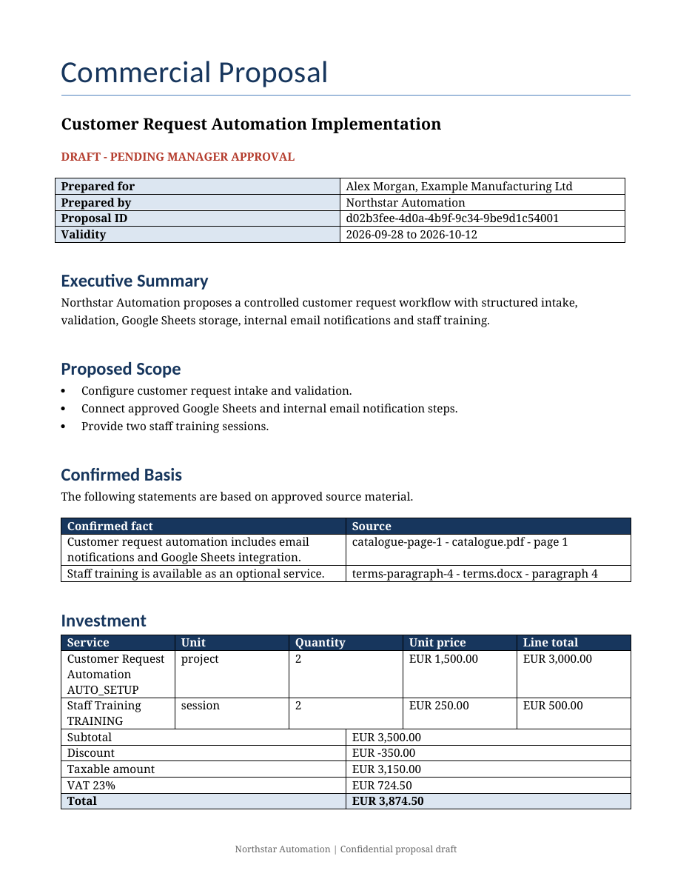

# AI Document & Proposal Assistant

Portfolio demonstration project for **Northstar Automation**. It turns approved business documents and a client request into an evidence-backed commercial proposal with deterministic pricing and mandatory manager approval.

> This is a synthetic portfolio project, not a paid client engagement. Demo names, requests, prices and documents are fictional. Real-client delivery is intentionally disabled.



## What it demonstrates

- secure ingestion of PDF, DOCX, XLSX and UTF-8 CSV files;
- normalized text, tables, source locations and deterministic chunks;
- persistent local RAG retrieval with replaceable offline/Gemini embeddings;
- prompt-injection-resistant evidence context with source attribution;
- approved service-catalogue validation and `Decimal` pricing;
- configurable VAT and named volume-discount rules;
- styled English DOCX generation and LibreOffice PDF conversion;
- FastAPI request, draft, status, approval, rejection and audit endpoints;
- n8n orchestration with Gmail manager notification;
- replay-safe Approve/Reject actions stored transactionally in SQLite;
- automated acceptance, failure-recovery and public-export security tests.

## Demo result



The included synthetic example calculates:

| Item | Amount |
|---|---:|
| Subtotal | EUR 3,500.00 |
| Volume discount (10%) | EUR 350.00 |
| Taxable amount | EUR 3,150.00 |
| VAT (23%) | EUR 724.50 |
| Total | **EUR 3,874.50** |

The same authoritative values are verified in both DOCX and PDF. The generated document remains clearly marked **DRAFT – PENDING MANAGER APPROVAL** until a manager decision is recorded.

Demo files:

- [Sample request](demo/sample-request.json)
- [Approved service catalogue](demo/service-catalog.csv)
- [Generated DOCX proposal](demo/artifacts/northstar-commercial-proposal.docx)
- [Generated PDF proposal](demo/artifacts/northstar-commercial-proposal.pdf)
- [Manager approval flow](docs/assets/approval-workflow.svg)

## Architecture and data flow

1. Approved files are validated against type, signature, size, path and archive-safety rules.
2. Text and table rows are normalized, chunked and stored with filename plus page/sheet/row metadata.
3. The retrieval layer returns only indexed evidence above the configured threshold.
4. Requested service codes are validated against the approved catalogue.
5. Python recalculates subtotal, discount, VAT and total using `Decimal`.
6. DOCX and PDF drafts are generated with matching values and source references.
7. n8n emails protected draft links to the manager.
8. Approve or Reject is persisted in SQLite; repeated identical actions are idempotent.
9. No workflow node sends the document to a real client.

## Safety controls

- source documents and retrieved text are treated as untrusted data;
- AI cannot set prices, discounts, VAT, availability or approval status;
- unknown/inactive services and invalid quantities stop generation;
- path traversal, symlinks, corrupt signatures and unsafe Office archives are rejected;
- review tokens are stored only as SHA-256 hashes;
- invalid tokens cannot access drafts or audit events;
- partial proposal files are removed after generation failure;
- rejected/pending proposals cannot finalize;
- opposite manager decisions return HTTP 409;
- the public n8n export is inactive and contains no credentials or webhook IDs;
- `.env`, local databases, customer files and runtime outputs are excluded.

## Technology

Python 3.12–3.14, FastAPI, Pydantic, SQLite, pypdf, python-docx, openpyxl, LibreOffice, n8n and Gmail OAuth. Gemini embeddings are available through an adapter; the deterministic offline adapter is used by the test suite and consumes no API quota.

## Local setup

LibreOffice must be installed for DOCX-to-PDF conversion.

```bash
python -m venv .venv
```

Windows PowerShell:

```powershell
.venv\Scripts\Activate.ps1
python -m pip install --upgrade pip
python -m pip install -e ".[dev]"
Copy-Item .env.example .env
python -m uvicorn app.main:app --reload
```

If PowerShell script execution is disabled, activation is optional:

```powershell
.venv\Scripts\python.exe -m pip install -e ".[dev]"
.venv\Scripts\python.exe -m uvicorn app.main:app --reload
```

Open `http://127.0.0.1:8000/health`.

## Verification

```bash
python -m pytest
python scripts/security_scan.py .
```

Expected Phase 8 result:

```text
62 passed
Public export security scan passed
```

The 12-criterion acceptance matrix is documented in [Phase 7 Report](docs/PHASE_7_REPORT.md). Phase 8 publication checks are documented in [Phase 8 Report](docs/PHASE_8_REPORT.md).

## Core API

| Method | Endpoint | Purpose |
|---|---|---|
| `GET` | `/health` | API and SQLite health |
| `POST` | `/api/v1/requests` | Validate request, price services and generate pending draft |
| `GET` | `/api/v1/proposals/{proposal_id}` | Read status and authoritative total |
| `GET` | `/api/v1/proposals/{proposal_id}/draft.pdf` | Protected manager PDF access |
| `GET` | `/api/v1/proposals/{proposal_id}/draft.docx` | Protected manager DOCX access |
| `POST` | `/api/v1/proposals/{proposal_id}/approve` | Record manager approval |
| `POST` | `/api/v1/proposals/{proposal_id}/reject` | Record rejection with comment |
| `GET` | `/api/v1/proposals/{proposal_id}/events` | Protected audit history |

## n8n

Import `n8n/phase-6-manager-approval.workflow.json`, configure `FASTAPI_BASE_URL` and `MANAGER_EMAIL` locally, then select a local Gmail credential. The exported workflow deliberately contains no credential identifier, API key, real email address or live webhook ID. See [n8n setup](n8n/README.md).

## Repository structure

```text
src/app/          FastAPI, ingestion, RAG, pricing, proposal and workflow logic
n8n/              Sanitized manager-approval workflow
demo/             Synthetic request, catalogue and generated proposal
docs/assets/      Architecture, approval flow and preview image
docs/             Phase reports and portfolio copy
scripts/          Demo generator and public-export security scan
tests/            Unit, integration, security and acceptance tests
```

## Scope

The MVP intentionally excludes OCR, production cloud deployment, multi-user authentication, CRM integration, electronic signatures, payment processing, multilingual proposals and automatic delivery to a real client.

## Project status

Phases 1–8 are implemented and verified. GitHub and Upwork publication are complete.

Copyright © 2026 Sergey. All rights reserved. No open-source license is granted. Reuse, redistribution or commercial use requires prior written permission.
